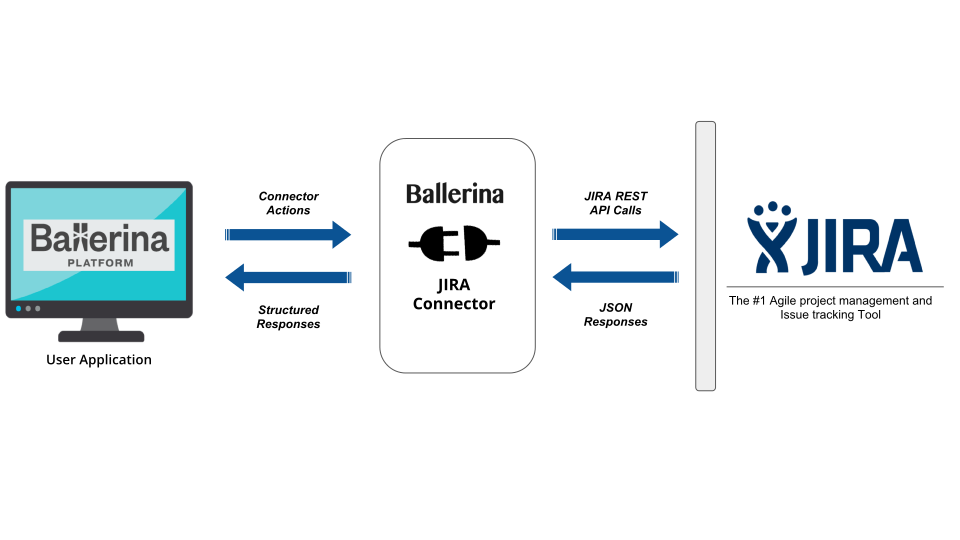

# Ballerina JIRA Connector
This Ballerina client connector allows to connect to Atlassian JIRA, which provides bug tracking, issue tracking, 
and project management functions. It uses the JIRA REST API to connect to JIRA, work with JIRA 
projects, view and update issues, work with jira user accounts, and more. It also handles basic authentication, 
provides auto completion and type conversions.

### Compatibility

| Ballerina Version   | JIRA REST API Version |
|:-------------------:|:---------------------:|
| 0.981.0             | 7.2.2                  |

